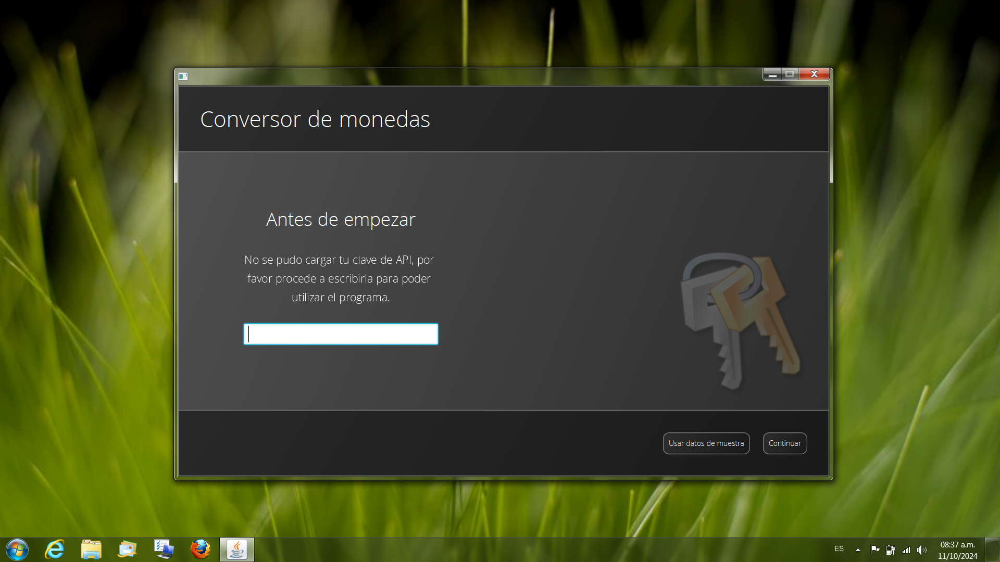
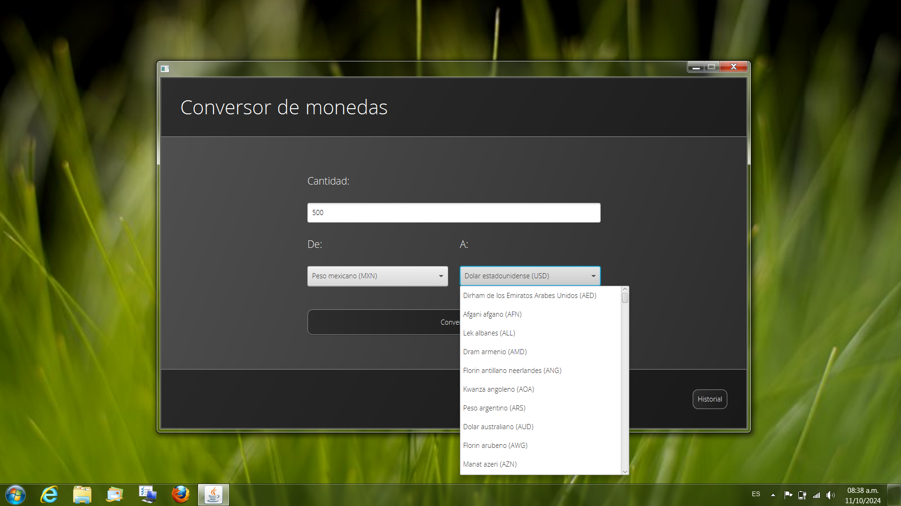
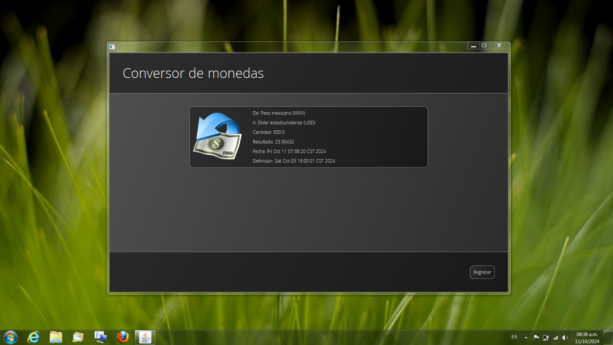

# Conversor de Monedas

La aplicación Conversor de Monedas es una útil herramienta para efectuar conversiones de cantidades entre distintas divisas de una forma fácil y amigable para el usuario final utilizando datos actualizados cortesía del api [Exchange Rate](https://www.exchangerate-api.com).

## Prerrequisitos

Para poder utilizar la aplicación con las últimas tasas de cambio es necesario contar con una clave de la api Exchange Rate, la cual puedes obtener [aquí]( https://app.exchangerate-api.com/sign-up), de lo contrario solo se contara con acceso a datos de demostración actualizados por última vez el 6 de octubre de 2024.

## Características

- Tasas de cambio actualizadas (vía Exchange Rate Api)
- Soporte para 160 monedas
- Modo demostración para entornos sin conexión
- Interfaz intuitiva y fácil de usar.
- Sistema persistente de inicio de sesión
- Historial persistente de conversiones

## Requisitos de compilación 

- Java SE Development Kit (Versión 21 o superior)
- Apache Maven (Versión 3.8.8 o superior)
